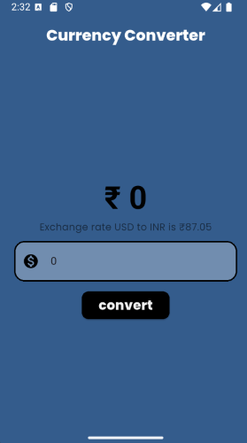

# Currency Converter

## Overview
This is a 'Currency Converter' app build in Flutter framework, this does not contains much Features yet, but i will improve it future by integrating API.
It supports only Dollar to Rupee conversion. 

## Getting Started
### Prerequisites
Ensure you have the following installed:
- [Flutter SDK](https://flutter.dev/docs/get-started/install)
- [Dart SDK](https://dart.dev/get-dart)
- Android Studio or Visual Studio Code
- Xcode (for iOS development)

### Installation
1. Clone the repository:
   ```sh
   git clone https://github.com/vedantvisoliya/currency_converter.git
   cd currency_converter
   ```
2. Install dependencies:
   ```sh
   flutter pub get
   ```
3. Run the project:
   ```sh
   flutter run
   ```
   
## Build & Deployment
To generate a release build:
```sh
flutter build apk   # For Android
flutter build ios   # For iOS
```

## Contribution
Contributions are welcome! Please open an issue or submit a pull request.

## Screenshots

